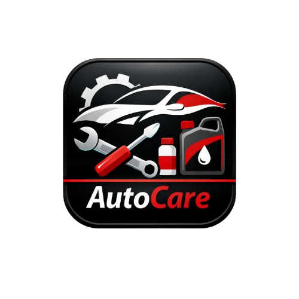

# AutoCare

<p align="center">
  
</p>

## Descripción

AutoCare es una aplicación móvil desarrollada para ayudar a los propietarios de vehículos a gestionar y controlar el mantenimiento de sus automóviles. La aplicación permite registrar vehículos, almacenar historiales de mantenimiento y llevar un control de gastos relacionados con el cuidado vehicular.

## Objetivo

Facilitar el seguimiento de mantenimientos preventivos y correctivos mediante una herramienta móvil sencilla, accesible y organizada.

## Tecnologías utilizadas

- Android Studio
- Java
- SQLite
- XML
- Git y GitHub

## Arquitectura

Patrón MVC (Modelo - Vista - Controlador)

## Estructura del proyecto

```text
com.autocare
│
├── activities
│   ├── DashboardActivity.java
│   ├── DetalleVehiculoActivity.java
│   ├── GastosActivity.java
│   ├── LoginActivity.java
│   ├── MantenimientoActivity.java
│   ├── RegisterActivity.java
│   ├── RegistrarMantenimientoActivity.java
│   └── VehiculoActivity.java
│
├── models
├── database
├── adapters
├── utils
└── MainActivity.java
```

## Funcionalidades principales

- Autenticación: Pantalla de Login para acceso de usuarios.

- Panel de Control (Dashboard): Resumen general de flota, gastos y recordatorios mecánicos.

- Gestión de Vehículos: Listado interactivo de vehículos registrados y acceso a detalles individuales.

- Formulario de Registro: Captura de datos técnicos de nuevos automóviles (Marca, Modelo, Año, Placa).

- Registro de Mantenimientos: Control de servicios preventivos y correctivos.

- Control de Gastos: Historial económico aplicado al cuidado vehicular.

## Desarrollador

Emil Rodriguez

## Asignatura

Seminario de Proyecto II (ISW-411)

## Estado del proyecto

Prototipo funcional implementado (Fase de desarrollo de interfaces, navegación y lógica base de actividades).